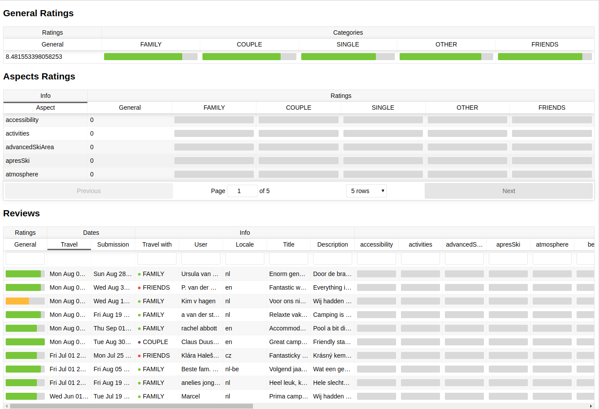

## Choices

The most effective solution I've implemented so far to perform a similar task was using static json files on s3 + lambda.
I didn't follow the same approach for two main reasons, the first being you guys on google not aws and me viceversa (I didn't want to complicate your life even further),
the second being difficulties in replicating the whole aws s3/lambda infrastructure as an understandable poc for not aws users.

Since no specifications on budget, kpi were provided, I decided to try a an ideally performance focused setup, with redis and a new framework I always wanted to try, fastify.
I have to say I had quite bright expectations, but I've got a bit disappointed.

Due to time constraints I didn't focus too much on documentation, usually I would've also attacched quite few dots flow charts

The solution offer a front end and a back end folder, ideally it would have been two repos, but for your own convenience I placed them all in one

the final result should be something like this:



### Front end

```sh
cd front-end
```

The Readme of the front end it is autogenerated

### Back end

```sh
cd back-end
```
